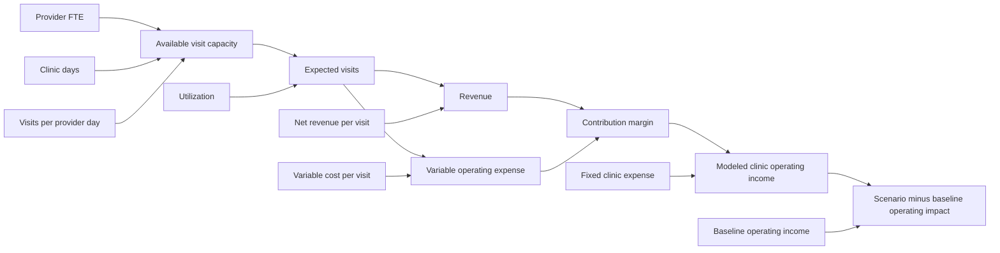

# Healthcare Provider FP&A Copilot — scenario-first portfolio specification

Status: needs-info
Approval: Revised proposal awaiting user approval. Earlier variance-first approval does not approve this revision. Do not create/revise tickets, recover code or implement before approval.
Date: 2026-09-15
Product: Healthcare Provider FP&A Copilot
Primary MVP demo: Driver-Based Scenario Modeling
Secondary module: Evidence-Aware Variance Investigation

This revision follows the user's latest product clarification, with earlier discovery and compatible evidence boundaries retained. It supersedes the previous variance-first scope for review. Existing tickets are provisional and no longer represent the proposed primary experience; they are unchanged in this task. Previous specification versions remain in Git history.

## 1. Revised Product Vision

Healthcare Provider FP&A Copilot connects financial performance with operational context while preserving analyst judgment. Its portfolio experience connects two questions: **“What happens if an assumption changes?”** through Driver-Based Scenario Modeling, and **“What happened, and why?”** through Evidence-Aware Variance Investigation.

The primary audience is a healthcare provider FP&A / financial analyst; the recruiting audience is a healthcare finance hiring manager. The interactive web demo must demonstrate business problem discovery, dependency-based finance modeling, requirements translation, deterministic calculation controls, bounded interpretation and human judgment.

The business hypothesis is faster, more transparent exploration and communication of financial implications. No measured ROI, customer adoption, clinical realism or forecast accuracy is claimed from synthetic examples.

## 2. Revised MVP definition and user problem

The required deliverable is a **working interactive web application suitable for a 60–90 second screen recording**. A CLI, static dashboard, specification or rendered mockup alone cannot satisfy it.

The default landing workspace is Scenario Modeling for one synthetic Clinic-Month. An analyst changes one upstream assumption, preferably Provider FTE from 4.0 to 3.5. All dependent financial outputs recalculate automatically and visibly, a comparison with an immutable baseline updates, commentary describes the modeled implication, and the analyst reviews the scenario.

The experience resembles a governed FP&A spreadsheet: explicit assumptions, inspectable formulas, a fixed baseline, read-only dependent outputs and no hidden model calculations in an LLM. Analysts should not manually propagate changes through capacity, visits, revenue and expense cells.

Customer discovery previously identified operational context validation and commentary drafting as manual work. The new primary modeling capability is a user-directed product expansion, not a claim that discovery validated these exact formulas. The secondary investigation module retains those discovery findings and evidence controls.

### End-to-end workflow

Baseline Scenario → user changes one driver → deterministic recalculation → baseline/scenario comparison → financial impact → bounded commentary → analyst scenario review.

Secondary workflow: Closed Month actual vs Latest Approved Forecast → Variance → Supporting Evidence → Operating Driver → commentary → human cause review.

### User stories

1. As a Provider FP&A Analyst, I want to change one operating assumption, so that I can see its financial consequences without editing downstream values.
2. As a Provider FP&A Analyst, I want an immutable baseline, so that I can distinguish scenario assumptions from the starting plan.
3. As a Provider FP&A Analyst, I want formulas and units visible, so that I can check the model.
4. As a Provider FP&A Analyst, I want capacity and utilization separated, so that I understand what turns available appointments into expected visits.
5. As a Provider FP&A Analyst, I want revenue, variable expense, contribution margin and fixed expense separated, so that operating impact is interpretable.
6. As a Provider FP&A Analyst, I want invalid assumptions rejected visibly, so that partial inputs do not produce misleading results.
7. As a Provider FP&A Analyst, I want changed drivers highlighted, so that I know what moved the outputs.
8. As a Provider FP&A Analyst, I want scenario implications phrased conditionally, so that a what-if does not become a prediction.
9. As a Provider FP&A Analyst, I want commentary tied to the current calculation snapshot, so that old wording cannot explain new numbers.
10. As a Provider FP&A Analyst, I want to review a scenario without changing the approved forecast, so that exploration remains under my control.
11. As a Provider FP&A Analyst, I want evidence-backed investigation available beside modeling, so that I can investigate actual performance before exploring an assumption.
12. As a Provider FP&A Analyst, I want unsupported causes kept unresolved, so that the model does not create false certainty.
13. As a Provider FP&A Analyst, I want related assumptions suggested without automatic changes, so that I decide how evidence informs scenarios.
14. As a portfolio presenter, I want an API-independent, resettable demo, so that I can reliably record it.
15. As a healthcare finance hiring manager, I want to see one edit drive multiple financial outputs, so that I can assess the candidate's modeling and business judgment quickly.

## 3. Editable scenario drivers

Use only seven numeric assumptions. Six are prominent inputs; fixed expense appears in the same compact assumptions panel as a seventh field. No large assumption library or administrator is required.

| Driver | Synthetic baseline | Units / proposed validity |
| --- | ---: | --- |
| Provider FTE | 4.0 | Effective provider FTE; finite, nonnegative, decimals allowed. |
| Clinic operating days | 22 | Days in selected month; integer from 0 through calendar days in month. |
| Visits per provider day | 45 | Available visit slots per effective FTE-day; finite, nonnegative. Label help clarifies capacity, not completed visits. |
| Utilization rate | 90% | Finite 0–100%; stored as a fraction. |
| Net revenue per visit | $195 | USD per expected visit; finite, nonnegative. |
| Variable operating cost per visit | $32 | USD per expected visit; finite, nonnegative. Includes modeled variable labor only to the extent included in this unit cost. |
| Fixed clinic operating expense | $200,000 | USD per month; finite, nonnegative. Proposed synthetic modeling assumption, not an observed benchmark cost. |

Provider FTE is an effective productive-capacity assumption, not a headcount/payroll contract. All effective FTE share the same days and productivity assumption. Lower FTE does not automatically reduce salaries or fixed expense. Variable expense changes only through expected visits. This is a simplified operating model, not a staffing optimizer.

The baseline remains immutable during edits; reset restores it. Multiple driver edits may be supported using the same calculation path, but the primary recording changes only FTE. Every scenario starts from a complete copy of baseline assumptions. Label baseline “Synthetic planning baseline,” not an authenticated approved forecast.

## 4. Deterministic dependency graph

Every valid edit triggers this graph in dependency order. Only descendants of a changed assumption change; a revenue-per-visit change cannot change visits. The baseline and scenario use the same deterministic function. No editable downstream output, LLM call, network fetch or manual calculate-each-cell step participates in the calculation.

## 5. Formulas and calculation responsibilities

| Output | Deterministic relationship |
| --- | --- |
| Available visit capacity | Provider FTE × clinic days × visits per provider day |
| Expected visits | Available visit capacity × utilization fraction |
| Revenue | Expected visits × net revenue per visit |
| Variable operating expense | Expected visits × variable operating cost per visit |
| Contribution margin | Revenue − variable operating expense |
| Modeled clinic operating income | Contribution margin − fixed clinic operating expense |
| Monthly forecast impact | Scenario modeled operating income − baseline modeled operating income |
| Absolute change for each output | Scenario output − baseline output |
| Percentage change | (Scenario − baseline) / baseline × 100, when baseline is positive; otherwise N/A with reason |

Use the standard contribution-margin definition before fixed costs. The alternative expression subtracting fixed expense is labeled modeled operating income. Do not present it as consolidated GAAP operating income: excluded items include corporate allocations, interest, tax and any costs outside the seven-input model. “Forecast impact” means hypothetical one-month model impact against the synthetic baseline, not an updated approved forecast or automatic annualization.

Use decimal-safe arithmetic and preserve internal precision through dependencies. Round only display values: USD to cents, percentage changes to two decimals, expected visits up to two decimals. Fractional expected visits are valid planning expectations, not individual encounters. Displaying an integer must not feed rounding back into revenue; prefer showing the fractional expectation where necessary.

Reject NaN, infinity, negative inputs, invalid days and utilization outside bounds. Clearing a field shows a draft validation state; do not convert blank to zero. During invalid input, show the last valid results explicitly as stale and disable review; never mix snapshots. Zero volume is allowed: revenue/variable cost/contribution are zero and modeled operating income equals negative fixed expense.

All assumptions, output units, baseline ID, Clinic-Month, changed-driver list and calculation revision form a structured ScenarioResult. Commentary and review reference this exact revision. No case ID or demo answer is substituted for calculations.

## 6. Scenario outputs and reconciled example

With the proposed inputs, baseline expected visits are **3,564**, not 4,000. Preserve the user-suggested 22 days, 45 slots and 90% utilization rather than hardcode incompatible output examples.

| Output | Baseline FTE 4.0 | Scenario FTE 3.5 | Change |
| --- | ---: | ---: | ---: |
| Available visit capacity | 3,960 | 3,465 | −495 (−12.50%) |
| Expected visits | 3,564 | 3,118.50 | −445.50 (−12.50%) |
| Revenue | $694,980.00 | $608,107.50 | −$86,872.50 |
| Variable operating expense | $114,048.00 | $99,792.00 | −$14,256.00 |
| Contribution margin | $580,932.00 | $508,315.50 | −$72,616.50 |
| Fixed clinic operating expense | $200,000.00 | $200,000.00 | $0.00 |
| Modeled clinic operating income | $380,932.00 | $308,315.50 | −$72,616.50 |
| Monthly forecast impact vs baseline | $0.00 | −$72,616.50 | Hypothetical downside |

The illustrative 4,000→3,500 visits in the request would require a different calibrated baseline. Its revenue downside of $97,500 and variable cost reduction of $16,000 imply **$81,500** contribution/operating downside when fixed costs are unchanged; scenario contribution would be **$570,500**. Those examples are coherent with 4,000 visits but not with the supplied capacity inputs. They are not the acceptance fixture proposed here.

Show absolute and percentage differences for outputs where meaningful. Red/green must consider business meaning: lower variable expense is a modeled cost reduction, while lower operating income is downside. Include words/icons rather than color alone. Reduced expense does not claim realizable payroll savings beyond the unit-cost assumption.

## 7. Webpage interaction design

Default navigation: **Scenario Modeling** (primary) and **Variance Investigation** (secondary), under Healthcare Provider FP&A Copilot. Use one professional desktop workspace optimized for screen recording, not separate driver-specific pages.

Left: editable assumptions with units, baseline values, changed-input highlighting and reset. Right: baseline/scenario/delta table or cards showing capacity, visits, revenue, variable expense, contribution margin, fixed expense, operating income and a prominent monthly impact. Below: formula trace, **AI Scenario Commentary** with conspicuous generation-mode disclosure, and Human Review.

On a valid input edit, recalculate automatically without a Calculate button. Proposed target: visible coherent update within 200 ms after a committed valid edit on the demo machine, measured separately from typing/debounce. No LLM or network latency on this path. Inputs, outputs and commentary update to one revision together; an old result cannot masquerade as current.

Provide keyboard-editable numeric fields, visible focus, explicit units, readable currency, compact help, sensible precision and clear validation messages. A slider is optional, not necessary. Keep the main driver edit and key financial outputs visible together on a 1440×900 reference viewport. Important disclosure must remain visible rather than hidden in a tooltip.

Scenario review uses session-only actions: **Reviewed — retain baseline**, **Request further investigation**, **Mark for forecast-assumption review**. None updates an approved forecast. Editing an assumption invalidates prior review for that scenario revision. There is no “confirm cause” action in a hypothetical scenario; cause review belongs to investigation. In-memory session state only; reset/session end discards it. No localStorage/sessionStorage or persistence guarantee across reload.

## 8. AI interpretation responsibilities and mode decision

The narrative layer consumes validated ScenarioResult; it explains changed assumptions, downstream movements, magnitude, conditional implications and analyst questions. It cannot perform authoritative arithmetic, modify outputs, invent assumptions, predict occurrence or update a forecast.

Approved prior constraint retained as the proposed default: **offline deterministic fallback, no API key required**. Heading may remain AI Scenario Commentary to communicate the architectural layer, but adjacent visible text must state **“Offline demo — deterministic commentary; no live LLM used.”** Do not describe this displayed text as actually AI-generated in recordings or portfolio claims.

The latest request's phrase “AI-generated business commentary” conflicts with this earlier explicit offline decision if meant literally. This revision proposes the reliable offline behavior, and asks for confirmation before approval; genuine live generation would be a separate scope choice. It is not silently assumed or implemented.

Example fallback wording, populated from computed fields:

“Under this scenario, reducing effective provider capacity from 4.0 to 3.5 FTE lowers expected visits by 12.5%, with utilization and productivity held constant. Modeled monthly revenue decreases by $86,872.50. Variable operating expense decreases by $14,256.00, partly offsetting the revenue effect. Fixed clinic expense remains unchanged, producing $72,616.50 of modeled operating-income downside. Would coverage changes or demand constraints alter these assumptions? This is a what-if scenario, not a predicted outcome or an approved forecast change.”

Numbers are formatted from deterministic fields, not recomputed in text generation. Do not attribute multi-input changes to a single driver or invent a decomposition; identify all changed assumptions and report their joint effect. If the result is invalid or stale, withhold current commentary/review. Preserve an optional guarded narrative interface without adding an API integration requirement.

## 9. Relationship to Evidence-Aware Variance Investigation

Retain the existing secondary contract: one Closed Month actual versus Latest Approved Forecast, deterministic review rules, facts and evidence separated from conclusions, source lineage, seven Driver Families, and Candidate/Supported/Rejected/Unresolved/Analyst-Confirmed boundaries. Only human review can confirm a supported cause. Keep the configurable 50% horizon threshold as a disclosed demo heuristic, not a universal healthcare FP&A standard. Recurrence is separate from Temporary/Structural timing.

Preserve C01 (supported explanation), C04 (unresolved/no invented cause), C03 (upstream context versus direct financial driver), with remaining cases as regression coverage in the same workflow. C01 primary Demand & Volume and contributing Provider Availability remain distinct. C03 weather is upstream, clinic capacity contributes, volume is primary. C04 must not invent reduced availability or temporary recovery.

Connection: a reviewed supported driver may offer **Explore related assumption**. This opens Scenario Modeling with an origin reference and a highlighted related field, but no automatic assumption change. For Provider Availability, highlight effective Provider FTE; a PTO event does not itself provide an approved numeric FTE conversion. The analyst enters the hypothetical value. Unresolved C04 offers further investigation, not a prefilled causal scenario.

Scenario baseline assumptions are separate synthetic planning inputs, not derived from benchmark gold answers or retroactively asserted to equal C01 financial records. Show that distinction when navigating. Never mix the scenario baseline with the investigation's Latest Approved Forecast. This small handoff connects the product story without building a new forecast system.

Investigation retains four session actions: confirm cause, reject cause, keep unresolved, request further investigation. Switching modules preserves only current-session context; a scenario review does not confirm an investigation cause and vice versa.

## 10. Exact 60–90 second recruiting demo flow

Target recording: 85 seconds; all actions are visible and reproducible.

| Time | Screen action | Narration / takeaway |
| --- | --- | --- |
| 0–8 s | Open product on Scenario Modeling; show synthetic/offline disclosure. | “This copilot helps healthcare finance analysts connect operating assumptions to financial performance.” |
| 8–18 s | Show the 4.0 FTE baseline and formula trace. | “The primary workflow is a governed what-if model: inputs are editable; financial outputs are calculated.” |
| 18–30 s | Change only Provider FTE from 4.0 to 3.5. | “One assumption changes. I do not edit visits, revenue or expenses.” |
| 30–43 s | Point to visits, revenue, variable expense, contribution margin and monthly impact updating. | “At unchanged utilization, revenue falls $86.9K; variable expense offsets $14.3K, leaving $72.6K of modeled operating downside.” |
| 43–55 s | Show AI Scenario Commentary and offline label. | “Interpretation follows the deterministic results. This demo uses a disclosed deterministic fallback, not a live model. It cannot change the forecast.” |
| 55–70 s | Switch to Variance Investigation, select C04, open evidence and unresolved state. | “Investigation asks what happened and why. Here the evidence does not support a cause, so the system refuses to invent one.” |
| 70–85 s | Select Keep unresolved or Request further investigation; show Human Review state. | “The analyst owns the decision. Calculations first, interpretation second, human judgment last.” |

The first 55 seconds explain user, problem, dependent calculations, interpretation boundaries and retained analyst authority. C01 and C03 are available for a longer follow-up, not extra mandatory steps crowding this recording. A separate optional walkthrough shows C01 → related assumption → scenario → analyst review.

## 11. Acceptance criteria, test strategy and definition of done

### Acceptance criteria

- A01: A running interactive web application opens with Scenario Modeling primary and Variance Investigation secondary, correctly branded and visibly synthetic/offline.
- A02: Editing only FTE 4.0→3.5 yields every value in the reconciled example without manual downstream editing; baseline remains unchanged.
- A03: Each of seven inputs has correct dependency behavior. Changing fixed expense changes operating income/impact but not contribution margin; changing unit revenue does not change visits; changing utilization affects visits and downstream financials but not available capacity.
- A04: Formula inspection, units, rounding and N/A percentage behavior are explicit. Invalid inputs cannot produce current-looking results or actionable review.
- A05: Valid edits update the coherent output snapshot within the proposed 200 ms target on the recording machine, independent of network/model availability.
- A06: Commentary references the current computed revision, shows changed assumptions and conditional implications, and cannot modify results or claim certainty. No obsolete text after an edit.
- A07: Scenario review is session-only and tied to the exact assumptions; further edits require new review. No approved forecast is mutated.
- A08: C04 retains unresolved cause/timing and refuses fabricated availability explanations. C01 and C03 preserve their documented driver roles and human confirmation boundary.
- A09: Related-assumption navigation preserves source context but does not infer numeric FTE from PTO, change assumptions automatically or mix scenario and investigation baselines.
- A10: Full investigation regression covers ten cases and forbidden conclusions; gold outputs never enter the analysis or narrative inputs.
- A11: The timed 60–90 second screen-recordable flow demonstrates the one-input cascade, commentary, C04 and human review. Record actual rehearsal evidence; do not claim hiring-manager validation without conducting it.
- A12: Demo runs without a live API key, external healthcare APIs, database, authentication, real PHI or persistent browser state. Offline narrative is sufficient only with explicit disclosure, subject to mode confirmation in section 8.

### Proposed test boundaries for approval

Introduce one small public deterministic scenario calculation boundary: complete valid assumptions in, ScenarioResult out. This is genuinely new functionality; do not force hypothetical planning assumptions into the historical actual-versus-forecast InvestigationResult. Retain historical investigation and guarded narrative boundaries for the secondary module.

Scenario tests use independent expected-value fixtures, all seven single-driver dependency checks, multi-edit joint output, identity/reset, zero values, invalid inputs, baseline-zero/negative percentage handling and internal precision. Verify financial identities and that only dependency descendants move. Test no-op inputs returning the baseline and fixed-cost changes leaving contribution margin unchanged.

Narrative tests verify current-snapshot numbers, conditional language, no invented assumptions or attribution and clear offline identity. Human tests exercise scenario actions separately from the four investigation actions, stale-review invalidation and session reset.

A focused browser suite changes one input and checks every dependent output, input validation, reset, navigation/handoff, C04 refusal and review state. Record actual recalculation latency on the demo machine. Run the complete selectively recovered test suite and full ten-case evaluator before integration and again after changes. Historical reports are prior art, not current passing evidence.

### Definition of done

After specification approval and later implementation authorization: a runnable, visually clear web demo satisfies A01–A12; all reported tests were actually executed; the primary 85-second workflow can be recorded without hidden edits or network dependencies; model assumptions/formulas and synthetic limitations are inspectable; human actions stay session-only and do not update forecasts. A written demo script alone does not count as completion. The present task delivers only this specification, not the application or recording.

## 12. Existing-code reuse, conflicts and approval decisions

The current checkout contains documents and benchmark data, not runnable application code. Historical snapshot 40e4829 contains Phase 3, Phase 4, tests and the prior Streamlit UI. Nothing is recovered in this task.

| Historical asset | Reuse assessment |
| --- | --- |
| Decimal parsing and variance arithmetic | Reuse finite-number/precision conventions and applicable comparison helpers. Historical fields mean actual/comparator, so do not mislabel scenario outputs as actuals; a thin new scenario contract is required. |
| Phase 3 loading, engine, review, evidence, drivers, timing | Preserve as secondary investigation baseline. Inspect against the revised spec and rerun tests after approved recovery. No replacement of business logic to serve the scenario UI. |
| Source lineage and human-confirmation boundaries | Reuse for investigation; scenario assumptions/review need separate snapshot references, not fictitious observed evidence. |
| Phase 4 guarded narrative architecture | Reuse separation of deterministic results from interpretation, injected transport testing and fallback/guard patterns. Its current NarrativeInput requires an InvestigationResult; it is not a drop-in scenario commentary generator. Add a narrow scenario formatter/adapter only after approval. |
| Existing benchmark inputs and evaluator | Retain ten-case investigation regression and C01/C04/C03; do not force new scenario baseline numbers into old cases or change gold fixtures to fit the recording. |
| Historical tests | Recover compatible tests, execute full suite and inspect failures. No historical test currently proves reactive scenario modeling. |
| Historical Streamlit UI | Inspect later for reusable display patterns only. Its existence is not evidence of the required editable dependency model or recording-ready layout; framework selection remains an implementation choice. |

The scenario graph, immutable baseline/scenario state, reactive web workspace and scenario-specific commentary/review are new requirements. Preserve existing investigation architecture rather than rebuild it. Report any recovered business-logic conflict before changing it.

Existing ADRs and terminology describe an investigation-only first MVP and exclude forecast/budget workflows. This proposal deliberately expands the demo to a **bounded hypothetical one-month scenario calculator** while still excluding actual forecast editing, budgets and production forecasting. That is a documented scope change, not permission to silently rewrite ADRs, glossary or historical code. Any later documentation alignment must distinguish scenario-vs-baseline deltas from actual-vs-approved-forecast variances.

### Decisions proposed for user approval

1. Use the seven baseline inputs and reconciled 3,564→3,118.50 visit example, including the proposed $200,000 fixed monthly expense. These are synthetic demonstration assumptions, not industry benchmarks.
2. Use conventional contribution margin before fixed expense and separately labeled modeled operating income/one-month impact.
3. Retain the previously approved offline-default commentary with explicit disclosure. If “AI-generated” is intended literally, resolve that change before approval; no live generation is assumed.
4. Approve the new scenario public test boundary alongside preserved investigation/narrative boundaries, the 200 ms interaction target and current-session scenario review actions.

After approval, revisit ticket structure around the primary scenario outcome. Do not execute the existing variance-first five tickets unchanged. No tickets are created or modified here; no code recovery, implementation, dependency installation or deployment is authorized by this revision.

## Non-goals and future scope

No authentication, databases, browser persistence, enterprise permissions, external healthcare APIs, PHI, RAG, multi-user collaboration, production deployment architecture, real-data mapping, dozens of assumptions, optimization, Monte Carlo simulation, payroll engine, multi-period forecasts, consolidated statements or approved-forecast writes. Live LLM generation remains optional future scope unless explicitly changed.

Future opportunities include richer forecast review, budget-versus-actual analysis, management reporting, operational KPI review and market/reimbursement context. They are not designed in detail or required for this recruiting demo.

## Reference basis

User-supplied product/discovery conclusions govern scope; retained domain/ADR documents and historical Phase 3/4 source govern compatible analytical behavior. The choice of upstream assumptions driving operational/financial outputs follows driver-based planning practice ([Anaplan](https://www.anaplan.com/resources/papers/driver-based-budgeting/)). Contribution margin excludes fixed costs; modeled operating income subtracts them separately ([Corporate Finance Institute](https://corporatefinanceinstitute.com/resources/accounting/contribution-margin-overview/)). These references inform modeling structure, not claims that the synthetic parameters represent healthcare benchmarks.
