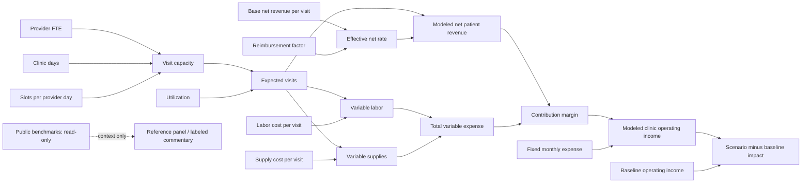

# Healthcare Provider FP&A Copilot — hybrid-data, scenario-first portfolio specification

Status: needs-info
Approval: Revised proposal awaiting user approval. Earlier variance-first approval does not approve this revision. Do not create/revise tickets, recover code or implement before approval.
Date: 2026-09-15
Product: Healthcare Provider FP&A Copilot
Primary MVP demo: Driver-Based Scenario Modeling
Secondary module: Evidence-Aware Variance Investigation

This revision follows the user's latest hybrid-data strategy and product clarification, with earlier discovery and compatible evidence boundaries retained. It supersedes the previous variance-first scope for review. Existing tickets are provisional and no longer represent the proposed primary experience; they are unchanged in this task. Previous specification versions remain in Git history.

## 1. Revised Product Vision

Healthcare Provider FP&A Copilot connects financial performance with operational context while preserving analyst judgment. It uses a hybrid dataset: real public company benchmarks for reference context and separately labeled synthetic clinic planning inputs for computation. Its portfolio experience connects two questions: **“What happens if an assumption changes?”** through Driver-Based Scenario Modeling, and **“What happened, and why?”** through Evidence-Aware Variance Investigation.

The primary audience is a healthcare provider FP&A / financial analyst; the recruiting audience is a healthcare finance hiring manager. The interactive web demo must demonstrate business problem discovery, dependency-based finance modeling, requirements translation, deterministic calculation controls, bounded interpretation and human judgment.

The business hypothesis is faster, more transparent exploration and communication of financial implications. No measured ROI, customer adoption, clinical realism or forecast accuracy is claimed from synthetic examples.

## 2. Revised MVP definition and user problem

The required deliverable is a **working interactive web application suitable for a 60–90 second screen recording**. A CLI, static dashboard, specification or rendered mockup alone cannot satisfy it.

The default landing workspace is Scenario Modeling for one synthetic Clinic-Month. An analyst changes one upstream assumption, preferably Provider FTE from 4.0 to 3.5. All dependent financial outputs recalculate automatically and visibly, a comparison with an immutable baseline updates, commentary describes the modeled implication, and the analyst reviews the scenario.

The experience resembles a governed FP&A spreadsheet: explicit assumptions, inspectable formulas, a fixed baseline, read-only dependent outputs and no hidden model calculations in an LLM. Analysts should not manually propagate changes through capacity, visits, revenue and expense cells.

Customer discovery previously identified operational context validation and commentary drafting as manual work. The new primary modeling capability is a user-directed product expansion, not a claim that discovery validated these exact formulas. The secondary investigation module retains those discovery findings and evidence controls.

### End-to-end workflow

Baseline Scenario → user changes one driver → deterministic recalculation → baseline/scenario comparison → financial impact → bounded commentary → analyst scenario review.

Secondary workflow: Closed Month actual vs Latest Approved Forecast → Variance → Supporting Evidence → Operating Driver → commentary → human cause review.

### User stories

1. As a Provider FP&A Analyst, I want to change one operating assumption, so that I can see its financial consequences without editing downstream values.
2. As a Provider FP&A Analyst, I want an immutable baseline, so that I can distinguish scenario assumptions from the starting plan.
3. As a Provider FP&A Analyst, I want formulas and units visible, so that I can check the model.
4. As a Provider FP&A Analyst, I want capacity and utilization separated, so that I understand what turns available appointments into expected visits.
5. As a Provider FP&A Analyst, I want revenue, variable labor, variable supplies, total variable expense, contribution margin and fixed expense separated, so that operating impact is interpretable.
6. As a Provider FP&A Analyst, I want invalid assumptions rejected visibly, so that partial inputs do not produce misleading results.
7. As a Provider FP&A Analyst, I want changed drivers highlighted, so that I know what moved the outputs.
8. As a Provider FP&A Analyst, I want scenario implications phrased conditionally, so that a what-if does not become a prediction.
9. As a Provider FP&A Analyst, I want commentary tied to the current calculation snapshot, so that old wording cannot explain new numbers.
10. As a Provider FP&A Analyst, I want to review a scenario without changing the approved forecast, so that exploration remains under my control.
11. As a Provider FP&A Analyst, I want evidence-backed investigation available beside modeling, so that I can investigate actual performance before exploring an assumption.
12. As a Provider FP&A Analyst, I want unsupported causes kept unresolved, so that the model does not create false certainty.
13. As a Provider FP&A Analyst, I want related assumptions suggested without automatic changes, so that I decide how evidence informs scenarios.
14. As a portfolio presenter, I want an API-independent, resettable demo, so that I can reliably record it.
15. As a healthcare finance hiring manager, I want to see one edit drive multiple financial outputs, so that I can assess the candidate's modeling and business judgment quickly.

## 3. Editable scenario drivers

Use nine numeric assumptions, reflecting the requested split of variable labor/supply costs and a simple reimbursement sensitivity. No detailed payer-contract engine or dozens of assumptions.

| Driver | Synthetic baseline | Units / validity |
| --- | ---: | --- |
| Provider FTE | 4.0 | Effective productive FTE; finite and nonnegative. |
| Clinic operating days | 22 | Integer 0 through selected month's calendar days. |
| Visits per provider day | 18 | Available slots per effective FTE-day; finite and nonnegative. |
| Utilization | 90% | Fraction in [0,1], displayed as percent. |
| Base net revenue per visit | $195 | USD per expected visit; finite and nonnegative. |
| Variable labor cost per visit | $55 | USD per expected visit; finite and nonnegative. |
| Variable supply cost per visit | $18 | USD per expected visit; finite and nonnegative. |
| Fixed monthly clinic expense | $85,000 | USD per month; finite and nonnegative. |
| Payer / reimbursement factor | 1.00× | Dimensionless finite nonnegative relative sensitivity; 1.00 leaves base net rate unchanged. Not a disclosed payer mix or collection probability. |

These are **Synthetic clinic-level planning assumptions** selected for demonstration. Public-company benchmarks inform cost-category context, not a mathematical estimate of HCA clinic economics. The reimbursement factor is a deliberate scenario overlay on the already-net base rate; it is not a second deduction of contractual allowances. No public payer-mix percentage automatically sets this factor.

Provider FTE is an effective productive-capacity assumption, not a headcount/payroll contract. All effective FTE share the same days and productivity assumption. Lower FTE does not automatically reduce salaries or fixed expense. At unchanged unit costs, variable labor and supply expenses change only through expected visits. Fixed expense does not automatically fall with FTE; the cost categories must not double-count variable labor or supplies. This is a simplified operating model, not a staffing optimizer.

The baseline remains immutable during edits; reset restores it. Multiple driver edits may be supported using the same calculation path, but the primary recording changes only FTE. Every scenario starts from a complete copy of baseline assumptions. Label baseline “Synthetic planning baseline,” not an authenticated approved forecast.

## 4. Deterministic dependency graph

Every valid edit triggers this graph in dependency order. Only descendants of a changed assumption change; a revenue-per-visit change cannot change visits. The baseline and scenario use the same deterministic function. No editable downstream output, LLM call, network fetch or manual calculate-each-cell step participates in the calculation.

## 5. Formulas and calculation responsibilities

| Output | Deterministic relationship |
| --- | --- |
| Available visit capacity | Provider FTE × clinic days × visits per provider day |
| Expected visits | Available visit capacity × utilization fraction |
| Effective net revenue per visit | Base net revenue per visit × payer/reimbursement factor |
| Modeled net patient revenue | Expected visits × effective net revenue per visit |
| Variable labor expense | Expected visits × variable labor cost per visit |
| Variable supply expense | Expected visits × variable supply cost per visit |
| Total variable expense | Variable labor expense + variable supply expense |
| Contribution margin | Modeled net patient revenue − total variable expense |
| Modeled clinic operating income | Contribution margin − fixed clinic operating expense |
| Monthly forecast impact | Scenario modeled operating income − baseline modeled operating income |
| Absolute change for each output | Scenario output − baseline output |
| Percentage change | (Scenario − baseline) / baseline × 100, when baseline is positive; otherwise N/A with reason |

Use the standard contribution-margin definition before fixed costs. Because the input is a net realized rate, label its product **modeled net patient revenue**, not gross charges or gross patient revenue. This clarifies the example formula name in the request without inventing gross-to-net adjustments. The alternative expression subtracting fixed expense is labeled modeled operating income. Do not present it as consolidated GAAP operating income: excluded items include corporate allocations, interest, tax and any costs outside the nine-input model. “Forecast impact” means hypothetical one-month model impact against the synthetic baseline, not an updated approved forecast or automatic annualization.

Use decimal-safe arithmetic and preserve internal precision through dependencies. Round only display values: USD to cents, percentage changes to two decimals, expected visits up to two decimals. Fractional expected visits are valid planning expectations, not individual encounters. Displaying an integer must not feed rounding back into revenue; prefer showing the fractional expectation where necessary.

Reject NaN, infinity, negative inputs, invalid days and utilization outside bounds. Clearing a field shows a draft validation state; do not convert blank to zero. During invalid input, show the last valid results explicitly as stale and disable review; never mix snapshots. Zero volume is allowed: revenue/variable cost/contribution are zero and modeled operating income equals negative fixed expense.

All synthetic assumptions, output units, baseline ID, Clinic-Month, changed-driver list and calculation revision form a structured ScenarioResult. Commentary and review reference this exact revision. No case ID or demo answer is substituted for calculations.

## 6. Scenario outputs and reconciled example

Use the newly supplied synthetic baseline, replacing the prior 45-slot/$32 unit-cost example. With FTE as the sole changed input and reimbursement factor held at 1.00×:

| Output | Baseline FTE 4.0 | Scenario FTE 3.5 | Change |
| --- | ---: | ---: | ---: |
| Available capacity | 1,584 | 1,386 | −198 (−12.50%) |
| Expected visits | 1,425.60 | 1,247.40 | −178.20 (−12.50%) |
| Modeled net patient revenue | $277,992.00 | $243,243.00 | −$34,749.00 |
| Variable labor expense | $78,408.00 | $68,607.00 | −$9,801.00 |
| Variable supply expense | $25,660.80 | $22,453.20 | −$3,207.60 |
| Total variable expense | $104,068.80 | $91,060.20 | −$13,008.60 |
| Contribution margin | $173,923.20 | $152,182.80 | −$21,740.40 |
| Fixed monthly expense | $85,000.00 | $85,000.00 | $0.00 |
| Modeled clinic operating income | $88,923.20 | $67,182.80 | −$21,740.40 |
| Monthly scenario / forecast impact | $0.00 | −$21,740.40 | Hypothetical downside |

Public values are not operands in these calculations. Switching a benchmark company/period cannot change any row above. All baseline and scenario values remain synthetic, including clinic identity and forecast inputs.

Show absolute and percentage differences for outputs where meaningful. Red/green must consider business meaning: lower variable expense is a modeled cost reduction, while lower operating income is downside. Include words/icons rather than color alone. Reduced expense does not claim realizable payroll savings beyond the unit-cost assumption.

## 7. Webpage interaction design

Default navigation: **Scenario Modeling** (primary) and **Variance Investigation** (secondary), under Healthcare Provider FP&A Copilot. Use one professional desktop workspace optimized for screen recording, not separate driver-specific pages.

Left: editable assumptions with units, baseline values, changed-input highlighting and reset. Right: baseline/scenario/delta table or cards showing capacity, visits, revenue, variable labor, variable supplies, total variable expense, contribution margin, fixed expense, operating income and a prominent monthly impact. Below: formula trace, **AI Scenario Commentary** with conspicuous generation-mode disclosure, and Human Review.

On a valid input edit, recalculate automatically without a Calculate button. Proposed target: visible coherent update within 200 ms after a committed valid edit on the demo machine, measured separately from typing/debounce. No LLM or network latency on this path. Inputs, outputs and commentary update to one revision together; an old result cannot masquerade as current.

Provide keyboard-editable numeric fields, visible focus, explicit units, readable currency, compact help, sensible precision and clear validation messages. A slider is optional, not necessary. Keep the main driver edit and key financial outputs visible together on a 1440×900 reference viewport. Important disclosure must remain visible rather than hidden in a tooltip.

Scenario review uses session-only actions: **Reviewed — retain baseline**, **Request further investigation**, **Mark for forecast-assumption review**. None updates an approved forecast. Editing an assumption invalidates prior review for that scenario revision. There is no “confirm cause” action in a hypothetical scenario; cause review belongs to investigation. In-memory session state only; reset/session end discards it. No localStorage/sessionStorage or persistence guarantee across reload.

## 8. AI interpretation responsibilities and mode decision

The narrative layer consumes validated ScenarioResult; it explains changed assumptions, downstream movements, magnitude, conditional implications and analyst questions. It cannot perform authoritative arithmetic, modify outputs, invent assumptions, predict occurrence or update a forecast.

Approved prior constraint retained as the proposed default: **offline deterministic fallback, no API key required**. Heading may remain AI Scenario Commentary to communicate the architectural layer, but adjacent visible text must state **“Offline demo — deterministic commentary; no live LLM used.”** Do not describe this displayed text as actually AI-generated in recordings or portfolio claims.

The latest request's phrase “AI-generated business commentary” conflicts with this earlier explicit offline decision if meant literally. This revision proposes the reliable offline behavior, and asks for confirmation before approval; genuine live generation would be a separate scope choice. It is not silently assumed or implemented.

Example fallback wording, populated from computed fields:

“Under these synthetic assumptions, reducing effective provider FTE from 4.0 to 3.5 lowers expected visits by 12.5%, with utilization, productivity and reimbursement held constant. Modeled monthly revenue decreases by $34,749.00. Variable labor decreases by $9,801.00 and supplies by $3,207.60, partly offsetting the revenue loss. With fixed expense unchanged, modeled clinic operating income decreases by $21,740.40. Would coverage or demand constraints alter these assumptions? This hypothetical clinic scenario does not represent HCA operations or an approved forecast change.”

Numbers are formatted from deterministic fields, not recomputed in text generation. Do not attribute multi-input changes to a single driver or invent a decomposition; identify all changed assumptions and report their joint effect. If the result is invalid or stale, withhold current commentary/review. Preserve an optional guarded narrative interface without adding an API integration requirement.

## 9. Relationship to Evidence-Aware Variance Investigation

Retain the existing secondary contract: one Closed Month actual versus Latest Approved Forecast, deterministic review rules, facts and evidence separated from conclusions, source lineage, seven Driver Families, and Candidate/Supported/Rejected/Unresolved/Analyst-Confirmed boundaries. Only human review can confirm a supported cause. Keep the configurable 50% horizon threshold as a disclosed demo heuristic, not a universal healthcare FP&A standard. Recurrence is separate from Temporary/Structural timing.

Preserve C01 (supported explanation), C04 (unresolved/no invented cause), C03 (upstream context versus direct financial driver), with remaining cases as regression coverage in the same workflow. C01 primary Demand & Volume and contributing Provider Availability remain distinct. C03 weather is upstream, clinic capacity contributes, volume is primary. C04 must not invent reduced availability or temporary recovery.

Connection: a reviewed supported driver may offer **Explore related assumption**. This opens Scenario Modeling with an origin reference and a highlighted related field, but no automatic assumption change. For Provider Availability, highlight effective Provider FTE; a PTO event does not itself provide an approved numeric FTE conversion. The analyst enters the hypothetical value. Unresolved C04 offers further investigation, not a prefilled causal scenario.

Scenario baseline assumptions are separate synthetic planning inputs, not derived from benchmark gold answers or retroactively asserted to equal C01 financial records. Show that distinction when navigating. Never mix the scenario baseline with the investigation's Latest Approved Forecast. This small handoff connects the product story without building a new forecast system.

Investigation retains four session actions: confirm cause, reject cause, keep unresolved, request further investigation. Switching modules preserves only current-session context; a scenario review does not confirm an investigation cause and vice versa.

## 10. Exact 60–90 second recruiting demo flow

Target recording: 85 seconds; all actions are visible and reproducible.

| Time | Screen action | Narration / takeaway |
| --- | --- | --- |
| 0–8 s | Open Scenario Modeling; point to PUBLIC HCA FY2025 reference and SYNTHETIC clinic inputs plus offline disclosure. | “Public HCA filings provide context; these editable clinic assumptions are synthetic. The copilot links operating assumptions to financial performance.” |
| 8–18 s | Show the 4.0 FTE baseline and formula trace. | “The primary workflow is a governed what-if model: inputs are editable; financial outputs are calculated.” |
| 18–30 s | Change only Provider FTE from 4.0 to 3.5. | “One assumption changes. I do not edit visits, revenue or expenses.” |
| 30–43 s | Point to visits, revenue, variable labor, variable supplies, total variable expense, contribution margin and monthly impact updating. | “At unchanged utilization, revenue falls $34.7K; labor and supplies offset $13.0K, leaving $21.7K of modeled operating downside.” |
| 43–55 s | Show AI Scenario Commentary and offline label. | “Interpretation follows the deterministic results. This demo uses a disclosed deterministic fallback, not a live model. It cannot change the forecast.” |
| 55–70 s | Switch to Variance Investigation, select C04, open evidence and unresolved state. | “Investigation asks what happened and why. Here the evidence does not support a cause, so the system refuses to invent one.” |
| 70–85 s | Select Keep unresolved or Request further investigation; show Human Review state. | “The analyst owns the decision. Calculations first, interpretation second, human judgment last.” |

The first 55 seconds explain user, problem, dependent calculations, interpretation boundaries and retained analyst authority. C01 and C03 are available for a longer follow-up, not extra mandatory steps crowding this recording. A separate optional walkthrough shows C01 → related assumption → scenario → analyst review.

## 11. Acceptance criteria, test strategy and definition of done

### Acceptance criteria

- A01: A running interactive web application opens with Scenario Modeling primary and Variance Investigation secondary, correctly branded and visibly synthetic/offline.
- A02: Editing only FTE 4.0→3.5 yields every value in the reconciled example without manual downstream editing; baseline remains unchanged.
- A03: Each of nine inputs has correct dependency behavior. Changing fixed expense changes operating income/impact but not contribution margin; changing unit revenue does not change visits; changing utilization affects visits and downstream financials but not available capacity.
- A04: Formula inspection, units, rounding and N/A percentage behavior are explicit. Invalid inputs cannot produce current-looking results or actionable review.
- A05: Valid edits update the coherent output snapshot within the proposed 200 ms target on the recording machine, independent of network/model availability.
- A06: Commentary references the current computed revision, shows changed assumptions and conditional implications, and cannot modify results or claim certainty. No obsolete text after an edit.
- A07: Scenario review is session-only and tied to the exact assumptions; further edits require new review. No approved forecast is mutated.
- A08: C04 retains unresolved cause/timing and refuses fabricated availability explanations. C01 and C03 preserve their documented driver roles and human confirmation boundary.
- A09: Related-assumption navigation preserves source context but does not infer numeric FTE from PTO, change assumptions automatically or mix scenario and investigation baselines.
- A10: Full investigation regression covers ten cases and forbidden conclusions; gold outputs never enter the analysis or narrative inputs.
- A11: The timed 60–90 second screen-recordable flow demonstrates the one-input cascade, commentary, C04 and human review. Record actual rehearsal evidence; do not claim hiring-manager validation without conducting it.
- A12: Demo runs without a live API key, external healthcare APIs, database, authentication, real PHI or persistent browser state. Offline narrative is sufficient only with explicit disclosure, subject to mode confirmation in section 8.
- A13: Public metrics are immutable, source-linked and typed separately from synthetic inputs; scenario edits, benchmark selection and narration cannot mutate them.
- A14: Each public metric retains company, period, unit, definition, source document/URL/type, source locator and transformation lineage; missing/unverified values never become invented zeroes.
- A15: UI distinguishes public actuals from editable synthetic inputs; no clinic assumption or scenario is labeled HCA internal data. No public admissions/occupancy/cost ratio silently populates a clinic driver.
- A16: Public loader supports a common schema for additional genuinely supplied companies, but displays only supplied/verified companies. Derived benchmark metrics are not mislabeled as reported.
- A17: Primary panel figures reconcile to the filing; percentage scales, payer-mix denominator, segment scope and net-income attribution remain correct. The nine-driver graph separately updates labor and supplies.
- A18: Public benchmark unavailability affects only reference display; scenario calculation still works and no benchmark is fabricated. Required HCA reference must be available in the completed recording build.

### Proposed test boundaries for approval

Introduce one small public deterministic scenario calculation boundary: complete valid assumptions in, ScenarioResult out. This is genuinely new functionality; do not force hypothetical planning assumptions into the historical actual-versus-forecast InvestigationResult. Retain historical investigation and guarded narrative boundaries for the secondary module.

Scenario tests use independent expected-value fixtures, all nine single-driver dependency checks, multi-edit joint output, identity/reset, zero values, invalid inputs, baseline-zero/negative percentage handling and internal precision. Verify financial identities and that only dependency descendants move. Test no-op inputs returning the baseline and fixed-cost changes leaving contribution margin unchanged.

Narrative tests verify current-snapshot numbers, conditional language, no invented assumptions or attribution and clear offline identity. Human tests exercise scenario actions separately from the four investigation actions, stale-review invalidation and session reset.

A focused browser suite changes one input and checks every dependent output, input validation, reset, navigation/handoff, C04 refusal and review state. Record actual recalculation latency on the demo machine. Run the complete selectively recovered test suite and full ten-case evaluator before integration and again after changes. Historical reports are prior art, not current passing evidence.

### Definition of done

After specification approval and later implementation authorization: a runnable, visually clear web demo satisfies A01–A18; all reported tests were actually executed; the primary 85-second workflow can be recorded without hidden edits or network dependencies; model assumptions/formulas, public lineage and synthetic limitations are inspectable; human actions stay session-only and do not update forecasts. A written demo script alone does not count as completion. The present task delivers only this specification, not the application or recording.

## 12. Existing-code reuse, conflicts and approval decisions

The current checkout contains documents and benchmark data, not runnable application code. Historical snapshot 40e4829 contains Phase 3, Phase 4, tests and the prior Streamlit UI. Nothing is recovered in this task.

| Historical asset | Reuse assessment |
| --- | --- |
| Decimal parsing and variance arithmetic | Reuse finite-number/precision conventions and applicable comparison helpers. Historical fields mean actual/comparator, so do not mislabel scenario outputs as actuals; a thin new scenario contract is required. |
| Phase 3 loading, engine, review, evidence, drivers, timing | Preserve as secondary investigation baseline. Inspect against the revised spec and rerun tests after approved recovery. No replacement of business logic to serve the scenario UI. |
| Source lineage and human-confirmation boundaries | Reuse for investigation; scenario assumptions/review need separate snapshot references, not fictitious observed evidence. |
| Phase 4 guarded narrative architecture | Reuse separation of deterministic results from interpretation, injected transport testing and fallback/guard patterns. Its current NarrativeInput requires an InvestigationResult; it is not a drop-in scenario commentary generator. Add a narrow scenario formatter/adapter only after approval. |
| Existing benchmark inputs and evaluator | Retain ten-case investigation regression and C01/C04/C03; do not force new scenario baseline numbers into old cases or change gold fixtures to fit the recording. |
| Historical tests | Recover compatible tests, execute full suite and inspect failures. No historical test currently proves reactive scenario modeling. |
| Historical Streamlit UI | Inspect later for reusable display patterns only. Its existence is not evidence of the required editable dependency model or recording-ready layout; framework selection remains an implementation choice. |

The scenario graph, immutable baseline/scenario state, reactive web workspace and scenario-specific commentary/review are new requirements. Preserve existing investigation architecture rather than rebuild it. Report any recovered business-logic conflict before changing it.

Existing ADRs and terminology describe an investigation-only first MVP and exclude forecast/budget workflows. This proposal deliberately expands the demo to a **bounded hypothetical one-month scenario calculator** while still excluding actual forecast editing, budgets and production forecasting. That is a documented scope change, not permission to silently rewrite ADRs, glossary or historical code. Any later documentation alignment must distinguish scenario-vs-baseline deltas from actual-vs-approved-forecast variances.

### Decisions proposed for user approval

1. Use the nine synthetic inputs and reconciled 1,425.60→1,247.40 visit example, with $85,000 fixed monthly expense and a 1.00× reimbursement factor. These are synthetic demonstration assumptions, not industry benchmarks.
2. Use conventional contribution margin before fixed expense and separately labeled modeled operating income/one-month impact.
3. Retain the previously approved offline-default commentary with explicit disclosure. If “AI-generated” is intended literally, resolve that change before approval; no live generation is assumed.
4. Approve the new scenario public test boundary alongside preserved investigation/narrative boundaries, the 200 ms interaction target and current-session scenario review actions.

After approval, revisit ticket structure around the primary scenario outcome. Do not execute the existing variance-first five tickets unchanged. No tickets are created or modified here; no code recovery, implementation, dependency installation or deployment is authorized by this revision.

## Non-goals and future scope

No authentication, databases, browser persistence, enterprise permissions, external healthcare APIs, PHI, RAG, multi-user collaboration, production deployment architecture, real-data mapping, dozens of assumptions, optimization, Monte Carlo simulation, payroll engine, multi-period forecasts, consolidated statements or approved-forecast writes. Live LLM generation remains optional future scope unless explicitly changed.

Future opportunities include richer forecast review, budget-versus-actual analysis, management reporting, operational KPI review and market/reimbursement context. They are not designed in detail or required for this recruiting demo.

## Reference basis

User-supplied product/discovery conclusions govern scope; retained domain/ADR documents and historical Phase 3/4 source govern compatible analytical behavior. The choice of upstream assumptions driving operational/financial outputs follows driver-based planning practice ([Anaplan](https://www.anaplan.com/resources/papers/driver-based-budgeting/)). Contribution margin excludes fixed costs; modeled operating income subtracts them separately ([Corporate Finance Institute](https://corporatefinanceinstitute.com/resources/accounting/contribution-margin-overview/)). These references inform modeling structure, not claims that the synthetic parameters represent healthcare benchmarks.

## 13. Hybrid Dataset Strategy and calibration limits

Maintain two independently identified data layers:

- **Public benchmark data:** HCA Healthcare FY2025 Annual Report/Form 10-K and the supplied workbook extraction. Read-only financial, operating, admission payer-mix and segment metrics; reference context only. FY2024/FY2023 comparisons can remain in the data but do not require extra UI.
- **Synthetic planning/investigation data:** analyst-editable clinic assumptions, computed scenario outputs and synthetic variance cases. They are not HCA internal budgets, staffing, forecasts or patient data.

No second public company dataset was found in the current repository inventory. Support future supplied/explicitly sourced providers through the common schema, but do not create a fake company row or benchmark. Selecting a company is optional UI until more than one exists. Do not average incomparable company metrics automatically.

Public benchmarks can motivate relevant cost categories and give enterprise-level context. They cannot establish a numerical “reasonable clinic range” from one company/year without comparable clinic-level definitions. In particular, equivalent admissions are not visits, inpatient occupancy is not clinic appointment utilization, and total salaries/benefits are not variable labor alone. No hospital-total-to-clinic allocation by hospital count, FTE, beds or revenue share is authorized.

Each synthetic assumption needs an assumption ID, value/unit, synthetic origin, rationale, optional benchmark references and a calibration method/status. For current baseline values the status is **designer-selected; public-context-informed; not numerically validated by HCA**. A benchmark-linked ratio may explain context, but is not a calibration formula unless a valid, documented comparable method exists.

Use the requested calibration language only with its meaning made explicit: “Synthetic clinic-level planning assumptions calibrated to public healthcare provider context; not estimates of HCA clinic operations.” The concise badge should simply say “Synthetic clinic-level planning assumptions.” Do not claim these supplied baseline values were empirically derived from HCA. This limitation is part of the project's credibility, not missing data to fill with invented claims.

## 14. Public Benchmark Data Model

Use one normalized record contract across the four public metric groups. Raw extracted values remain preserved alongside normalized values; the loader never accepts scenario overrides.

| Fields | Meaning / validation |
| --- | --- |
| company_id, company, ticker | Stable company identity; not used as a synthetic clinic identity. |
| period, period_start, period_end, period_type | Explicit fiscal year/instant date, not just an ambiguous year. End-of-period beds differ from annual flows. |
| metric_id, metric_name, metric_definition | Stable metric identity and exact meaning/denominator; distinguish total net income from income attributable to HCA. |
| value, unit | Normalized finite decimal or explicit unavailable status; USD absolute values, counts and ratios have distinct units. |
| raw_value, raw_unit, scale | Preserve $mm and percent representations before normalization; USD millions multiply by 1,000,000 once. |
| metric_group, scope, segment, payer_category, population_basis | Financial/operating/payer/segment group, consolidated versus segment scope, category and denominator. No duplicate consolidated and segment summation. |
| source_document, source_url, source_type | HCA FY2025 Annual Report/Form 10-K, canonical public link, Annual Report or SEC Form 10-K. Workbook is a user-supplied extraction intermediary, not HCA-issued internal data. |
| source_locator, extraction_reference | Printed page/table/footnote and workbook sheet/cell; retain document-specific page numbering. |
| provenance_kind, parent_metric_ids, derivation | Reported versus derived; derived ratios keep formula and exact source inputs. |
| validation_status, source_version | Verified/needs verification/unavailable, document hash or accession and extraction version. Only verified metrics appear as established public values. |

Identity includes company, period, metric, scope/category and source version. Duplicates or conflicting values fail explicitly. Missing values do not become zero. The public-metric schema is separate from ScenarioInput; no generic editable “metric value” collection shared between the two.

Payer_Mix is **share of admissions**, not revenue share or reimbursement rate. The workbook's 0.73 is a fraction displayed as 73%, despite a percent-like unit label. Preserve admission-share categories and sums subject to source rounding. Keep reported 43.5% salaries/revenue distinct from the exactly derived 32,859 / 75,600 ≈ 43.4643%; do not falsely give reported values extra precision.

Segment data must retain National, Atlantic and American Group identities and Adjusted Segment EBITDA definition. The supplied segment extract omits Corporate and other; those three revenue rows are not the consolidated total. Missing corporate/reconciliation rows must be disclosed or explicitly sourced from the filing, never manufactured to make a table add up. Adjusted Segment EBITDA is not the synthetic clinic's operating income.

## 15. Source validation findings and lineage requirements

Inspected supplied sources read-only: HCA_2025_Public_Dataset.xlsx (README, Income_Statement, Operating_Metrics, Payer_Mix, Segments, Scenario_Seed) and the 163-page browser-print HCA 10-K PDF. Verified headline financial and operating numbers against the corresponding filing text. Full extraction-row verification remains a later ingestion acceptance task, not a claim completed here.

The workbook's primary annual-report URL was opened and confirms FY2025 despite its directory naming. Retain both it and the canonical SEC filing URL. The local browser-print PDF has different physical page numbers from the published annual-report PDF: financial summary printed p.66 is local PDF page 102, operating summary printed p.67 is local page 103, and consolidated income statement F-5 is local page 136. Locators must identify the source document, not reuse page indices across versions.

Proposed small panel uses these verified FY2025 values:

| Metric | Normalized value | Display |
| --- | ---: | --- |
| Revenue | 75,600,000,000 USD | $75.600B |
| Salaries and benefits | 32,859,000,000 USD | $32.859B |
| Equivalent admissions | 4,107,152 equivalent admissions | 4.107M |
| Occupancy | 0.73 ratio | 73% |

Keep net income $7.782B distinct from net income attributable to HCA $6.784B if those metrics are shown. Source definitions govern interpretation. Scenario_Seed contains derived and rounded reference measures, not clinic assumptions; do not import it into the scenario baseline.

Canonical primary source: https://www.sec.gov/Archives/edgar/data/860730/000119312526044769/hca-20251231.htm

Public annual report: https://s23.q4cdn.com/949900249/files/doc_financials/2024/ar/HCA-2025-Annual-Report-to-Shareholders-FINAL.pdf

Every transformation retains input lineage and unit conversion. Derived metrics retain formula, parent metric IDs, period and scope. Public corrections are controlled source updates, never editable app assumptions. Freeze local verified extracts for recording reliability; loading the demo must not require a live SEC/network request. No source files are copied or transformed into application data during this specification task.

## 16. Public / synthetic separation and organization

Use separate public benchmark loading, synthetic scenario calculation, investigation and narrative responsibilities. The benchmark loader produces read-only contextual records; the scenario engine accepts only synthetic assumptions and model policy. Narrative receives these as separately labeled objects and may cite public context without blending values. A benchmark cannot promote a synthetic driver to Supported or Analyst-Confirmed Cause.

The proposed public data area is grouped by company, with financial, operating, payer and segment records plus source metadata. The synthetic area contains clinic baseline/scenario inputs and variance fixtures. This captures the user's proposed organization without requiring a sweeping rename of the existing investigation package. Preserve historical Phase 3/4 contracts where compatible; moving all modules is not necessary to establish the data boundary.

During later approved work, keep supplied raw documents immutable, normalize public records in their own loader and preserve existing synthetic benchmark fixtures and gold isolation. A company-agnostic schema is enough extensibility; no plugin registry, database or ingestion platform is required.

## 17. Benchmark-panel UX and narrative disclosure

Place a compact Public Benchmark card near the Scenario Modeling heading or below the main comparison; it must not push the editable FTE and dependent outputs out of the recording viewport. Show company and period with a **PUBLIC — READ-ONLY — SOURCE-LINKED** label. Include the four headline metrics and expandable definitions/sources. Public numbers have no editable controls; selecting a reference period/company cannot modify scenario state.

The assumptions panel carries **SYNTHETIC — EDITABLE — WHAT-IF MODEL**. The generated outputs carry **SYNTHETIC SCENARIO OUTPUT**. Labels supplement color. This distinction also appears when investigation is open; all C01/C04/C03 facts remain synthetic case evidence, not HCA incidents.

Expandable disclosure:

“This portfolio demonstration uses publicly available company financial and operating data for benchmark context. Clinic-level budgets, provider staffing assumptions, forecasts, and scenario inputs are synthetic because these internal FP&A inputs are not publicly disclosed. Public benchmarks inform context; they do not establish HCA clinic-level assumptions. This project is not affiliated with, sponsored by or endorsed by HCA Healthcare and uses no PHI or proprietary planning-system access.”

Commentary may state, with a source reference, that salaries and benefits are a large cost category in HCA's public data. It must qualify this as consolidated-company context and must not equate that figure to synthetic variable labor. No claims that a scenario depicts actual HCA staffing, payer contracts, forecasts, locations or performance. Public context remains optional to the narrative and is omitted if unverified or irrelevant; it never changes the calculation.

## 18. Hybrid acceptance tests and recording additions

In addition to A01–A18:

1. Attempt scenario edits and benchmark interactions; public records and their source metadata remain unchanged. No public-value setter is exposed to scenario controls.
2. Check synthetic input/output provenance and identity end-to-end, including reset, case handoff and commentary.
3. Switch benchmark context while holding scenario inputs fixed; numerical scenario results are identical. Remove/unavailable benchmark context; scenario still computes with an honest reference-unavailable state.
4. FTE 4.0→3.5 reproduces every value in section 6, including separate labor and supply. Reimbursement-factor edits change revenue, contribution and income but not capacity, visits, labor or supplies. Other single-driver dependency tests remain required.
5. Narration cannot write public or scenario data. Reject text presenting synthetic assumptions as HCA facts or turning admission shares into clinic reimbursement assumptions.
6. Verify source fields/locators survive import, unit normalization, derived-ratio calculation, display and any future output serialization. Test $mm conversion, ratio display and total-versus-attributable net income.
7. Test payer-mix denominators, consolidated/segment keys and incomplete segment scope. Duplicate or conflicting records are not silently overwritten. Missing public metrics are not zero-filled.
8. Browser checks verify visible PUBLIC/SYNTHETIC labels, read-only public fields, source links, editable synthetic fields and offline commentary disclosure. Check that the HCA company label is never used as the synthetic clinic identity.
9. Verify the same schema can load another genuinely supplied company's records without HCA-specific arithmetic. Current production/demo fixture contains only HCA; no fabricated second company. A purely synthetic schema test fixture, if needed, is isolated from public/demo data and explicitly labeled test-only.
10. Record the revised 85-second flow: 0–10s public-vs-synthetic disclosure; 10–20s baseline; 20–30s edit only FTE; 30–45s capacity/visits/revenue/labor/supplies/margin/income/impact; 45–60s commentary and deterministic-first explanation; 60–75s C04 refusal; 75–85s human review. Make HCA sourcing and the clinic's synthetic nature understandable within the first ten seconds.

The financial fixture calculations were independently checked during spec preparation. No application tests, data-loader implementation or UI have been created. Public verification of the complete workbook belongs to the later approved data intake work; raw source files remain unchanged.
